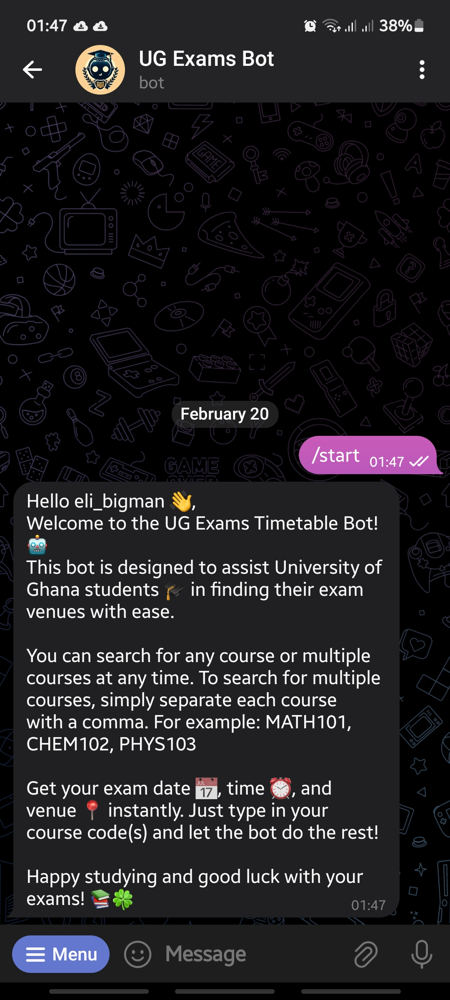
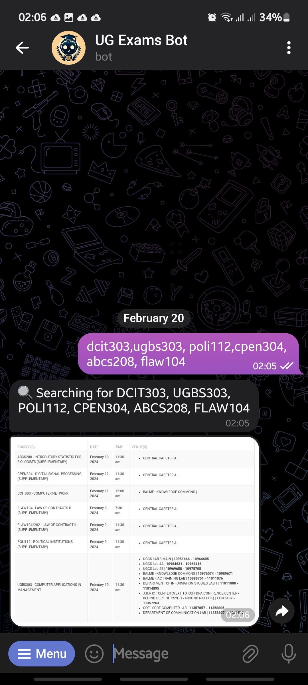
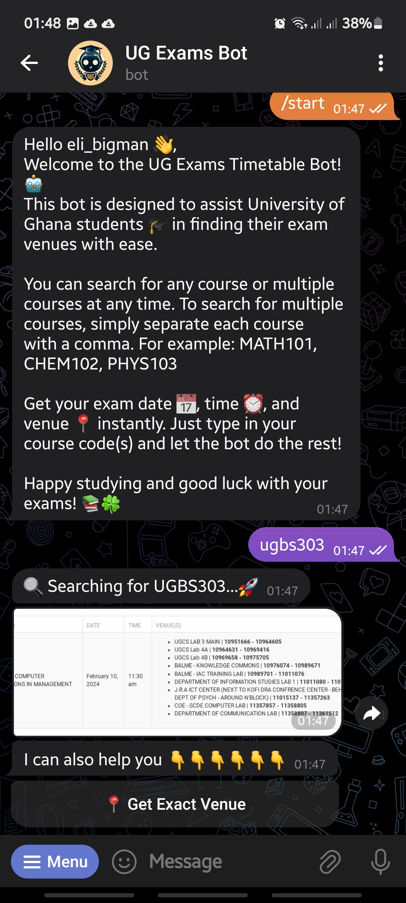
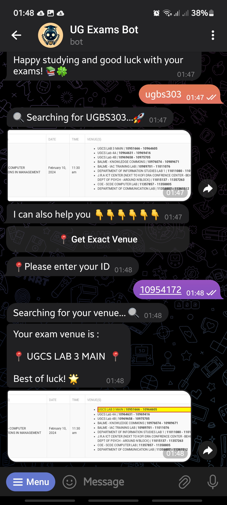

# Exam Timetable Bot

## Description
This is a telegram bot designed to help students keep track of their exam schedules. It's written in Python and uses various libraries to interact with users and manage data. The bot scrapes data from the UG timetable website to provide up-to-date exam schedules.

## Access
The bot can be accessed on Telegram at `https://t.me/ug_exams_bot`.

## Prerequisites
Before you begin, ensure you have met the following requirements:
- You have a valid Telegram Bot API token (from Botfather).
- You have your Telegram username.

## Installation
1. Clone this repository: 
```python 
git clone https://github.com/eli-bigman/exam_timetable_bot.git
```
2. Navigate to the project directory: 
```python 
cd exam_timetable_bot
```
3. Install the required dependencies:
 ```python 
 pip install -r requirements.txt
```
4. Run the python file with the following command:

```python
 python src/main.py
```
5. Rename `.envTemplate` to `.env` and replace the placeholders with your actual details.

## Usage
Here's how you can use the UG Exams Timetable Bot! 🤖

1. Start by searching for your course using its code. For example, you can type `MATH101` to search for the MATH101 course.

2. f exams has multiple venues use the Get Exact Venue button to search for the venue for your exams

3. If you want to search for multiple courses at once, simply separate each course code with a comma. For example: `MATH101, CHEM102, PHYS103`.

4. The bot will return your exam date 📅, time ⏰, and venue 📍 instantly.

## Screenshots

<p align="center">
  
  
</p>
<p align="center">
  
  
</p>


## To-Do
- [ ] Write test cases for all functions to ensure reliability and maintainability.
- [ ] Add a feature to set reminders for upcoming exams.

## Contributing
If you'd like to contribute, please fork the repository and use a feature branch. Pull requests are warmly welcome.

## License
The project is licensed under the MIT license.


```python
if youFoundItUseful:
    forkThisRepository()
